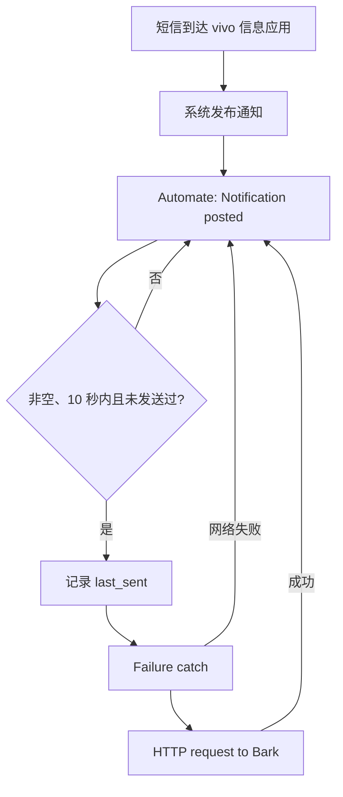

# Automate Bark SMS Forwarder for OriginOS

使用 Android 上的 [Automate](https://llamalab.com/automate/) 监听短信应用通知，并通过 [Bark](https://github.com/Finb/Bark) 推送到 iPhone。

这个方案主要解决 vivo / OriginOS 上的两个实际问题：

1. `SMS received` 能收到普通短信，却可能收不到运营商验证码；
2. 重启后通知访问服务可能没有正确重新绑定，或者一次 HTTP 断网就让整个 Flow 停止。

本项目不需要开发或安装自制 APK，所有逻辑都在 Automate 中完成。

## 工作原理



这里使用通知监听而不是单纯依赖短信广播。测试设备上，中国移动验证码通知来自：

```text
com.android.mms.service
```

不同厂商和短信应用的包名可能不同，请用 Automate 的通知输出或 Android 调试工具确认。

## 环境

- 测试手机：vivo（OriginOS 6 / Android 16）
- Automate：1.53.2
- 接收端：iPhone + Bark
- 推送接口：`https://api.day.app`

## 快速开始

### 1. 准备 Bark

在 iPhone 打开 Bark，复制自己的推送地址。不要把真实 Device Key 上传到 GitHub、截图或日志中。

先在安卓浏览器测试：

```text
https://api.day.app/YOUR_BARK_DEVICE_KEY__/测试
```

### 2. 导入主 Flow

下载并导入 [`flows/message-forward.flo`](flows/message-forward.flo)。

导入后打开 `HTTP request`，把占位符：

```text
YOUR_BARK_DEVICE_KEY__
```

替换成你的 Bark Device Key。

主 Flow 的 HTTP URL 表达式为：

```text
"https://api.day.app/YOUR_BARK_DEVICE_KEY__/" ++ urlEncode(notify_text || notify_ticker)
```

### 3. 配置 Notification posted

建议配置：

| 字段 | 值 |
| --- | --- |
| Proceed | When transition |
| Package | `com.android.mms.service`（按实际手机修改） |
| Exclude flags | `Group summary (Android 5+)` |
| Posted package | `notify_package` |
| Title | `notify_title` |
| Message | `notify_text` |
| Ticker text | `notify_ticker` |
| When timestamp | `notify_when` |

表达式判断会同时过滤空通知、历史通知和重复通知：

```text
(notify_text || notify_ticker) && (Now - notify_when) < 10 && (notify_text || notify_ticker) != last_sent
```

在表达式的 YES 路径使用 `Variable set`：

```text
last_sent = notify_text || notify_ticker
```

OriginOS / Android 16 会在新短信到达时更新通知组，可能短时间内重新发布旧验证码，并额外发布一个没有正文的组汇总通知。`Group summary`、时间窗口和 `last_sent` 三层过滤用于避免旧验证码与 `empty message` 被推送。

### 4. vivo / OriginOS 后台设置

必须为 Automate 开启：

- 通知使用权 / 通知访问权限
- 自启动
- 允许后台耗电
- 忽略电池优化
- 忽略应用休眠
- Automate 设置中的 `Run on system startup`

详细步骤见 [`docs/originos-setup.md`](docs/originos-setup.md)。

## 网络失败保护

`HTTP request` 前必须放置 `Failure catch`，否则一次临时断网、VPN 切换或 DNS 故障就可能出现：

```text
java.net.ConnectException
Stopped by failure
```

连接方式：

```text
Expression YES -> Variable set IN
Variable set OK -> Failure catch IN
Failure catch OK -> HTTP request IN
HTTP request OK -> Notification posted IN
Failure catch FAIL -> Notification posted IN
Expression NO -> Notification posted IN
```

因此一次推送失败只会丢失当前消息，不会让后续所有短信都停止转发。

## 重启后自动修复通知监听

OriginOS 重启后偶尔会保留“通知使用权”开关，但 Automate 的监听服务没有真正上线。可以创建第二个 Flow，在检测到 `boot_count` 变化后重新写入通知监听器设置。

为了避免覆盖其他应用的通知监听器，本仓库不提供绑定具体手机列表的成品 Flow。请按 [`docs/notification-repair.md`](docs/notification-repair.md) 创建安全版本。

## 故障排查

见 [`docs/troubleshooting.md`](docs/troubleshooting.md)。优先检查 Automate 常驻通知中的 fiber 数量：正常情况下应同时运行主 Flow 和自动修复 Flow。

## 隐私与安全

- Bark Device Key 相当于推送凭证，不要提交到版本库。
- 通知访问权限可以读取其他应用通知，务必在 Flow 的第一步按包名过滤。
- 验证码属于敏感信息，请勿上传真实日志和截图。
- 本项目只在所有者本人设备上测试，请遵守当地法律并仅处理你有权访问的短信。

## 相关项目

- [pppscn/SmsForwarder](https://github.com/pppscn/SmsForwarder)：功能完整的短信、来电和 APP 通知转发应用。
- [chekun/sms-bark](https://github.com/chekun/sms-bark)：专门将短信验证码转发到 Bark 的轻量应用。
- [jinweijie/notify-me](https://github.com/jinweijie/notify-me)：支持 Bark、邮件和 Webhook 的短信/来电转发应用。

如果你希望使用现成 App，上述项目可能更合适；本仓库重点是可修改的 Automate 低代码方案和 OriginOS 排障经验。

## License

[MIT](LICENSE)
