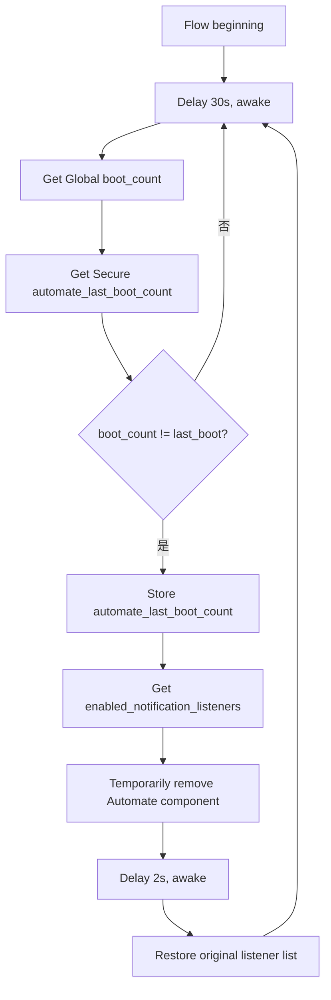

# 重启后修复通知监听

## 为什么需要

在部分 vivo / OriginOS 设备上，重启后“通知使用权”开关仍然显示开启，但 Automate 的 `NotificationListenerService` 可能没有真正重新绑定。手动关闭再开启通知使用权可以恢复。

这个 Flow 的作用就是在检测到设备重启后，自动完成一次等效的“关闭再开启”。

## 前置条件

Automate 需要修改 Secure Settings。连接电脑并使用 ADB 执行一次：

```shell
adb shell pm grant com.llamalab.automate android.permission.WRITE_SECURE_SETTINGS
```

然后确保 Automate 已在系统通知访问权限页面中手动授权过一次。

## 推荐 Flow



Automate 通知监听组件为：

```text
com.llamalab.automate/com.llamalab.automate.AutomateNotificationListenerServiceKitKat
```

## 安全原则

不要照抄其他手机完整的 `enabled_notification_listeners` 字符串。该设置还包含手表、自动化工具、学习软件等其他已授权应用，覆盖它会关闭别人的通知访问权限。

正确做法：

1. 先用 `System setting get` 读取当前 `enabled_notification_listeners` 到变量；
2. 临时从这个变量中移除 Automate 组件；
3. 等待 2 秒；
4. 恢复刚才读取的原始变量。

如果读取结果中没有 Automate 组件，停止自动修改并提示用户手动授权一次。

## boot_count 字段

- 分类：Global
- 名称：`boot_count`
- 输出变量：`boot_count`

用于保存上一次启动计数的自定义字段：

- 分类：Secure
- 名称：`automate_last_boot_count`
- 输出变量：`last_boot`

判断表达式：

```text
boot_count != last_boot
```

